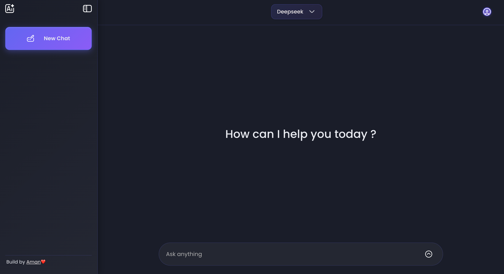

# LibreGPT

A modern full-stack AI chat app using React and Node.js that delivers a ChatGPT-style interface with threaded conversations, saved history, and real-time AI replies through OpenRouter. Switch between multiple AI models (ChatGPT, Gemini, DeepSeek, Nova 2 Lite) seamlessly in one conversation. It's free to use forever with no limits on conversation size.

🔗 **[Live Demo](https://buildsbyaman-LibreGPT.vercel.app)**


## ✨ Features

- **User Authentication** - Secure signup/login with Passport.js and session management
- **Authorization** - Thread ownership verification ensures users only access their own chats
- **Multiple AI Models** - Switch between ChatGPT, Gemini, DeepSeek, and Nova 2 Lite in real-time
- **Real-time AI Chat** - Interactive conversations with AI using OpenRouter
- **Thread Management** - Organize conversations into separate threads with unique IDs
- **Persistent Storage** - All chats stored in MongoDB with full history
- **Modern UI** - Clean, responsive interface inspired by ChatGPT
- **Fast & Efficient** - Built with Vite for optimal performance
- **Rate Limiting** - Protected API endpoints with express-rate-limit
- **Responsive Design** - Works seamlessly on desktop and mobile devices
- **Markdown Support** - Rich text formatting with syntax highlighting
- **Context Preservation** - Maintains conversation context within threads

## 📸 Screenshot



## 🛠️ Tech Stack

### Frontend

- **React** - Modern UI library
- **Vite** - Next-generation frontend tooling
- **React Markdown** - Markdown rendering with syntax highlighting
- **React Spinners** - Loading indicators
- **Rehype Highlight** - Code syntax highlighting

### Backend

- **Node.js** with **Express 5.1.0** - Server framework
- **MongoDB** with **Mongoose 9.0.0** - Database and ODM
- **Passport.js** - Authentication middleware with local strategy
- **Express Session** - Session management with MongoDB store
- **OpenAI SDK** - Integration with OpenRouter API
- **Express Rate Limit** - API rate limiting
- **CORS** - Cross-origin resource sharing
- **dotenv** - Environment variable management
- **Joi** - Input validation and sanitization

## 📋 Prerequisites

Before you begin, ensure you have the following installed:

- **Node.js** (v16 or higher)
- **pnpm** (or npm/yarn)
- **MongoDB** (local installation or MongoDB Atlas account)
- **OpenRouter API Key** (get one at [OpenRouter](https://openrouter.ai/))

## 📁 Project Structure

```
LibreGPT/
├── Backend/
│   ├── app.js                 # Express server configuration
│   ├── package.json           # Backend dependencies
│   ├── .env                   # Environment variables (not in repo)
│   ├── models/
│   │   └── thread.js          # MongoDB thread schema
│   ├── routes/
│   │   └── thread.js          # API routes for threads
│   └── utils/
│       └── AImodel.js         # OpenRouter AI integration
│
└── Frontend/
    ├── index.html             # HTML entry point
    ├── package.json           # Frontend dependencies
    ├── vite.config.js         # Vite configuration
    ├── src/
    │   ├── App.jsx            # Main application component
    │   ├── App.css            # Global styles
    │   ├── main.jsx           # React entry point
    │   ├── context.js         # React Context for state management
    │   └── components/
    │       ├── Chat.jsx       # Individual chat message component
    │       ├── Chat.css       # Chat styles
    │       ├── Chatwindow.jsx # Main chat interface
    │       ├── Chatwindow.css # Chat window styles
    │       ├── Sidebar.jsx    # Thread list sidebar
    │       └── Sidebar.css    # Sidebar styles
    └── public/                # Static assets
```

## 🎯 Key Features Explained

### Thread Management

- Each conversation is organized into a thread with a unique UUID
- Threads are automatically saved to MongoDB
- Users can create new threads, switch between threads, and delete old ones

### AI Integration

- Supports multiple AI models: ChatGPT, Gemini, DeepSeek, and Nova 2 Lite
- Switch models on-the-fly without losing conversation context
- Messages are sent with user context
- Responses are streamed back to the frontend

### State Management

- React Context API manages global state
- Handles current thread, message history, and UI state
- Efficient re-rendering with proper state updates

### Rate Limiting

- Prevents API abuse with 1000 requests per minute limit
- Configurable window and limit settings

## 🔧 Configuration

| Variable             | Description                   | Required           |
| -------------------- | ----------------------------- | ------------------ |
| `SESSION_SECRET`     | Secret key for sessions       | Yes                |
| `PORT`               | Backend server port           | No (default: 8080) |
| `MONGODB_URI`        | MongoDB connection string     | Yes                |
| `OPENROUTER_API_KEY` | OpenRouter API key            | Yes                |
| `VITE_API_URL`       | Backend API URL (in frontend) | Yes                |
